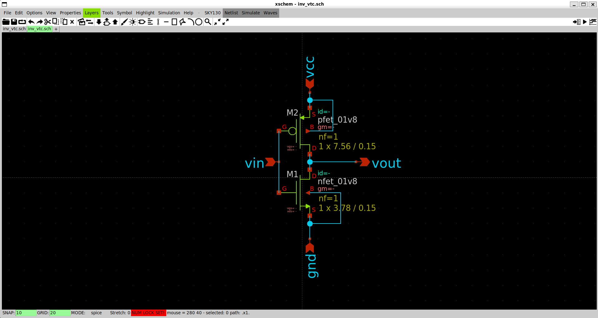
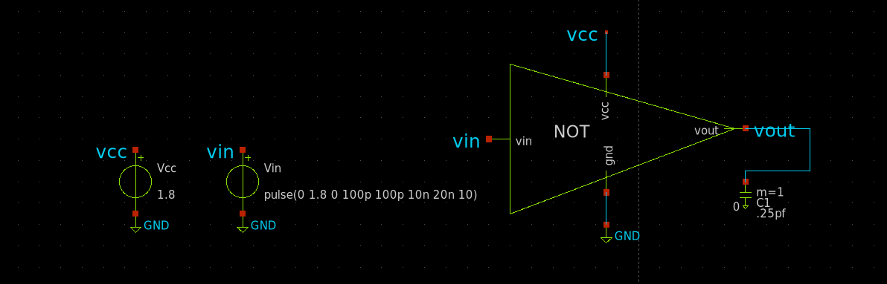

# 1.1 CMOS Inverter Architecture

## Theory

A CMOS (Complementary Metal-Oxide-Semiconductor) inverter consists of one PMOS transistor connected to the power supply (VDD) and one NMOS transistor connected to ground (GND). The gates of both transistors are connected together to form the input (VIN), while their drains are connected together to form the output (VOUT).

The complementary operation of the PMOS and NMOS transistors ensures that only one transistor conducts during steady-state operation. This results in low static power consumption, full output voltage swing, and high noise immunity, making the CMOS inverter the fundamental building block of digital integrated circuits.

### 📷 CMOS Inverter Architecture

> Insert architecture diagram here.

<p align="center">

</p>

---

# 1.2 PMOS and NMOS Operation

The operation of the CMOS inverter depends on the input voltage.

### Case 1 : VIN = 0 V

- PMOS is ON.
- NMOS is OFF.
- The output is connected to VDD.
- Output voltage is approximately **1.8 V (Logic HIGH)**.

### Case 2 : VIN = 1.8 V

- PMOS is OFF.
- NMOS is ON.
- The output is connected to Ground.
- Output voltage is approximately **0 V (Logic LOW)**.

This complementary switching action produces the logical inversion of the input signal while minimizing static power consumption.

### 📷 Simulation Proof

> Insert waveform showing VIN and VOUT.

<p align="center">

</p>

---

# 1.3 Device Sizing

The transistor dimensions determine the drive strength, propagation delay, power consumption, and switching characteristics of the inverter.

The following device dimensions were used.

| Parameter | Value |
|-----------|------:|
| PMOS Width | *(Add your value)* |
| PMOS Length | *(Add your value)* |
| NMOS Width | *(Add your value)* |
| NMOS Length | *(Add your value)* |

### Design Rationale

The minimum channel length supported by the SKY130 process is selected to maximize switching speed while maintaining reliable device operation. The PMOS width is typically chosen larger than the NMOS width to compensate for the lower hole mobility of PMOS devices, resulting in balanced rise and fall times.

---

# 1.4 Circuit Schematic

The CMOS inverter schematic was created using Xschem and SKY130 transistor models.

The PMOS source is connected to the supply voltage (VDD), while the NMOS source is connected to ground (GND). The gates of both devices share the input node (VIN), and the drains are connected together to form the output node (VOUT).

### 📷 CMOS Inverter Schematic

> Insert schematic here.

<p align="center">

</p>

---

# 1.5 SPICE Netlist

The SPICE netlist generated by Xschem represents the electrical description of the CMOS inverter.

It contains:

- PMOS transistor definition
- NMOS transistor definition
- Power supply
- Input source
- Load capacitor
- Simulation commands

```spice
* Paste your generated SPICE netlist here
```

The netlist is directly used by ngspice to perform circuit simulation and electrical analysis.

---

# 1.6 Testbench Development

A simulation testbench is developed to verify the functionality of the CMOS inverter under realistic operating conditions.

The testbench consists of:

- CMOS inverter
- 1.8 V DC supply
- Pulse voltage source
- 0.25 pF load capacitor
- Ground reference

The same testbench is used throughout this project for DC, transient, delay, timing, and power analyses.

### 📷 Testbench

> Insert complete testbench.

<p align="center">

</p>

---

# 1.7 Input Stimulus

A pulse voltage source is applied to repeatedly switch the inverter between logic LOW and logic HIGH.

| Parameter | Value |
|-----------|------:|
| Low Voltage | 0 V |
| High Voltage | 1.8 V |
| Rise Time | 100 ps |
| Fall Time | 100 ps |
| Pulse Width | 10 ns |
| Time Period | 20 ns |

The selected pulse parameters provide sufficient transition time for observing switching behavior and measuring timing characteristics.

### 📷 Input Waveform

> Insert input waveform.

<p align="center">

</p>

---

# 1.8 Load Capacitance

A **0.25 pF** capacitor is connected at the output node to emulate the capacitive loading encountered in practical integrated circuits.

The load capacitor models the combined effects of:

- Gate capacitance of subsequent logic stages
- Interconnect parasitic capacitance
- Diffusion capacitance

Including the load capacitor produces more realistic measurements of propagation delay, rise time, fall time, and dynamic power consumption.

### 📷 Load Capacitor Connection

> Insert screenshot showing the output capacitor.

<p align="center">

</p>

---

# 1.9 Design Verification

Before performing detailed characterization, the functionality of the CMOS inverter is verified using transient simulation.

### Expected Behaviour

| VIN | VOUT |
|------|------|
| 0 V | 1.8 V |
| 1.8 V | 0 V |

### 📷 Functional Verification

> Insert transient waveform showing VIN and VOUT.

<p align="center">

</p>

### Observation

- The output correctly follows the logical inversion of the input.
- Full voltage swing (0 V to 1.8 V) is observed.
- No abnormal oscillations or instability are present.
- The inverter is verified and ready for further analyses.

---

# ✅ Chapter Summary

A CMOS inverter was successfully designed using SKY130 PMOS and NMOS devices in Xschem. A complete simulation testbench was developed with a 1.8 V supply, pulse input source, and a 0.25 pF load capacitor. Functional verification confirmed correct inverter operation with full voltage swing, providing a reliable foundation for DC analysis, transient analysis, propagation delay, rise/fall time, and power characterization.
